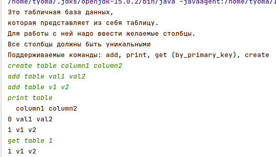

# ConsoleDataBase
Консольная база данных
Поддерживает команды:
- create - создаёт таблицу *Example: create TableName column1 column2 column3...*
- add (дальше идут значения в количестве равному количеству колонок) - добавляет строку в БД. *Example: add tableName val1 val2*
- get (число) - получить строку *Example: get tableName 1*
- print - выводит всю таблицу *Example: print tableName*

### Пример работы программы

